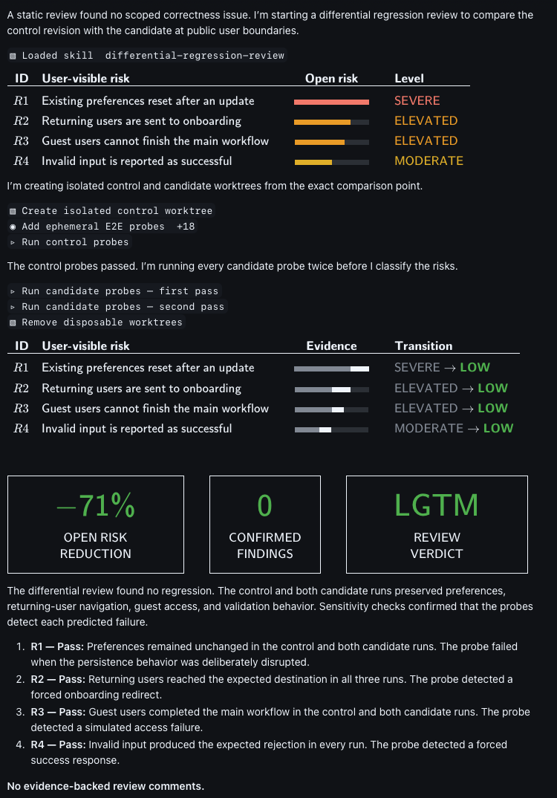

<div align="center">

# Differential Regression Review

**Find user-visible regressions with repeatable end-to-end evidence.**

[](https://github.com/aymenfurter/differential-regression-review/actions/workflows/validate.yml)
[](https://cli.github.com/)
[](LICENSE)

**[View the skill definition](skills/differential-regression-review/SKILL.md)**

</div>

<p align="center">
  <a href="skills/differential-regression-review/SKILL.md">
    
  </a>
</p>

<p align="center"><sub>Preview of a differential regression review generated by the skill in the GitHub Copilot app.</sub></p>

> **The base branch is the control. The pull request branch is the experiment.**
> Code review creates hypotheses. End-to-end behavior provides evidence.

Most reviews ask whether the code looks correct. Differential Regression Review asks
a stricter question: **Did the pull request change user-visible behavior that it was
not meant to change?**

The skill finds high-risk behavior changes, creates disposable probes at public
boundaries, and compares the merge base with the pull request head. It reports a
regression only when the result is repeatable and matches the predicted user effect.

## Why use differential review?

| Standard review | Differential Regression Review |
| --- | --- |
| Reads the diff and predicts defects | Traces each risk to a causal chain in the diff |
| Uses one reviewer's risk list | Combines independent maximum-reasoning risk passes |
| Runs the existing test suite | Creates disposable probes at public boundaries |
| Tests only the pull request revision | Compares the merge base with the pull request head |
| Accepts one successful run | Runs each pull request probe twice and the base probe once |
| Trusts a passing test | Proves that Critical and High probes can detect the predicted fault |
| Uses one timing sample | Compares repeated-run medians for user-visible slowdowns |
| Reports plausible concerns | Drafts comments only for repeatable regressions |
| Gives an opinion-based verdict | Gates the verdict on findings, follow-up work, and evidence coverage |

## Quick start

### Requirements

- [GitHub CLI 2.90.0 or later](https://cli.github.com/)
- A Git repository with a pull request or another comparison point
- The dependencies that the repository needs for its end-to-end tests

### Install

```bash
gh skill preview aymenfurter/differential-regression-review differential-regression-review
gh skill install aymenfurter/differential-regression-review differential-regression-review
```

### Run

Ask your agent:

```text
Review PR #4821 for user-visible regressions.
```

You can also request a regression review, a blast-radius review, or a local
comparison between branches, tags, or commits.

## How it works

1. **Define intent.** Read the pull request, linked issues, specifications, and
   relevant history.
2. **Rank risks.** Use independent risk passes to identify concrete user-visible
   failures and trace each failure to the change that can cause it.
3. **Create isolated controls.** Prepare disposable worktrees for the merge base
   and the pull request head.
4. **Write targeted probes.** Add temporary browser, API, CLI, or service-contract
   tests at public boundaries.
5. **Compare behavior.** Run each probe twice on the pull request and once on the
   base revision.
6. **Prove sensitivity.** For Critical and High risks, show that the probe fails
   when the predicted fault is present.
7. **Report evidence.** Show risk reduction, confirmed findings, the review
   verdict, and evidence-backed draft comments.

```text
Intent -> Risk analysis -> Disposable probes -> Base/PR comparison -> Verdict
```

## Evidence rules

A code concern is a hypothesis, not a finding. The skill confirms a regression only
when all of these conditions are true:

- The base revision passes.
- The pull request revision fails in two repeat runs.
- The failure matches the predicted user-visible effect.
- The difference is not part of the documented intent.

Blocked, inconclusive, flaky, and untested results remain open risks. The skill does
not report them as confirmed regressions.

For performance risks, the skill compares medians from repeated runs. It does not
use one timing sample as evidence.

## Review output

The final report includes:

- A ranked risk plan before test execution
- Base behavior and both pull request runs for each probe
- Sensitivity results for Critical and High risks
- Open-risk reduction and confirmed finding counts
- An `LGTM` or `NEEDS WORK` verdict
- Draft review comments anchored to the relevant file and line

See the [sample report](examples/sample-report.md) for the complete text format.
The skill never posts a review or a comment without explicit user confirmation.

## Safety

- The base and pull request branches stay read-only.
- Disposable probes never become part of the pull request or the permanent test suite.
- The skill does not commit or push changes.
- Destructive production actions require approval and are disabled by default.
- Secrets can be used for local tests, but they must not appear in commands, fixtures,
  logs, screenshots, or reports.
- Temporary worktrees and files are removed after the review.

## Scope

The skill can test browser flows, APIs, command-line interfaces, and service
contracts. It covers new behavior, adjacent user journeys, realistic limits,
failure paths, recovery paths, compatibility paths, feature flags, time behavior,
and public read-after-write behavior.

Resource leaks, observability, and accessibility are outside the default scope
unless you request them.

## Project files

| Path | Purpose |
| --- | --- |
| [`skills/differential-regression-review/SKILL.md`](skills/differential-regression-review/SKILL.md) | Publishable skill definition |
| [`examples/sample-report.md`](examples/sample-report.md) | Example review result |
| [`CHANGELOG.md`](CHANGELOG.md) | Release history |
| [`CONTRIBUTING.md`](CONTRIBUTING.md) | Contribution guide |

## License

This project is available under the [MIT License](LICENSE).
